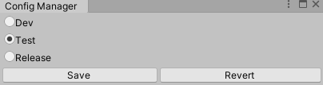

# GameSystem

### GameSystem

``GameSystem`` is the main class where all the framework's features are linked to. It is made as a singleton class for easy access.

| **public static void Register(IModule module)**              |
| :----------------------------------------------------------- |
| **public static void Register(Component module)**            |
| **public static void Register(object module)**               |
| Registers to the GameSystem. Registered objects are eligible to receive subscribed messages. |

| **public static void Unregister(IModule module)**            |
| ------------------------------------------------------------ |
| **public static void Unregister(Component component)**       |
| **public static void Unregister(object obj)**                |
| Unregisters from the GameSystem. Unregistered objects no longer receive the subscribed messages. |

| **public static T FindModule<T>() where T : IModule**        |
| ------------------------------------------------------------ |
| Finds and returns IModule by Type. Returns null when asked Type is not registered to the GameSystem. |


# IModule

IModule is an interface implemented to provide dependency injections for singleton-like objects. As it is intended for objects that behaves like singleton, you can register only one module for the same module type at a given time.

Modules can be implemented by inheriting the IModule interface.

Like MonoBehaviours, it can receive event such as Update, FixedUpdate.

Following are receivable events:

- void OnRegister()
- void OnUnregister()
- void Update()
- void LateUpdate()
- void FixedUpdate()


# Message System

One of framework's main features is the Message System which is based on Publish-Subscribe pattern.

You can simply create the Subscriber by adding the ``SubscriberAttribute`` and registering the object. The publishing part is done by Dispatching a Message class.

```c#
using System.Collections;
using System.Collections.Generic;
using GiraffeStar;
using UnityEngine;

// Create custom messages by inheriting the MessageCore class.
public class TestMessage : MessageCore
{

}

public class TestObject
{
	// Add the SubscriberAttribute to designate as a subscriber.
    // The should-be-received message becomes the parameter.
    [Subscriber]
    void Handle(TestMessage msg)
    {
        Debug.Log("Message received");
    }
}

public class TestOne : MonoBehaviour
{
    TestObject obj;
    
    void Awake()
    {
        obj = new TestObject();
        // Register to the GameSystem to begin handling.
        GameSystem.Register(obj);
    }

    void Start()
    {
    	// Call the Dispatch method to publish the message to its subcribers.
        // The dispatched message instance will be passed as the parameter for every subscriber.
        new TestMessage().Dispatch();
    }
}
```


### MessageCore

| **public string Filter**                                     |
| ------------------------------------------------------------ |
| The classifier used to filter its subscribers. It will send messages to only those with the same filter value. The default value is "Default". |

| **public void Dispatch()**                                   |
| ------------------------------------------------------------ |
| Publishes the message to all its subscribers. The calling instance will be passed on as the parameter for every subscriber. Thus, it is recommended to implement the fields as read-only. |


### SubscriberAttribute

| **public SubscriberAttribute(params string[] args)**         |
| ------------------------------------------------------------ |
| **public SubscriberAttribute()**                             |
| Designates the method as a subscriber.<br />``params string[] filters``: The filter values it will receive. Default value is "Default" |


# Custom Coroutine

GSUF implements a custom coroutine system called Mission. It works similarly like the Unity's coroutines, but is able to wait for more variety of options such as GSUF's messages. More options will be introduced as the development continues.

```c#
public class TestMessage : MessageCore
{
}

public class TestOne : MonoBehaviour
{
    void Start()
    {
        var mission = Mission.Create(TestMission);
        mission.Run();
    }
	
	// Uses IEnumerator just like Unity's coroutines.
    IEnumerator TestMission()
    {
        // yield return only the nested classes under the WaitFor class.
        yield return new WaitFor.Update();
        Debug.Log("Waited update");
        
        // null works same as WaitFor.Update()
        yield return null;

        yield return new WaitFor.Seconds(5f);
        Debug.Log("Waited 5 seconds");

		// you can also wait for messages.
        yield return new WaitFor.Message<TestMessage>();
        Debug.Log("Waited TestMessage");
    }
}
```


### Mission

| **public static Mission Create(Func<IEnumerator> instruction)** |
| ------------------------------------------------------------ |
| Creates coroutine.                                           |

| public void Run()                 |
| --------------------------------- |
| Starts or unpauses the coroutine. |

| public void Pause()   |
| --------------------- |
| Pauses the coroutine. |

| public void Cancel()   |
| ---------------------- |
| Cancels the coroutine. |

| public void Reset()                                         |
| ----------------------------------------------------------- |
| Resets the coroutine. Cancelled coroutines become reusable. |


### WaitFor

| WaitFor.Update() - ctor |
| ----------------------- |
| Waits for each update.  |

| WaitFor.LateUpdate() - ctor |
| --------------------------- |
| Waits for each late update. |

| WaitFor.FixedUpdate() - ctor |
| ---------------------------- |
| Waits for each fixed update. |

| WaitFor.Seconds(float time) - ctor |
| ---------------------------------- |
| Waits for given time.              |

| WaitFor.Message<T>() - ctor |
| --------------------------- |
| Waits for <T> message.      |


# Config System

### Config Files

When developing games, one would want to have different configs for each build. To meet with these needs, GSUF provides a easy-to-use config management system.

When the framework is first installed, it creates the basic config files in ``Assets/GiraffeStar/Config`` directory.


You can change the configs by viewing the config files in the inspector. The config values will be stored by key-value-pair method, so add the appropriate values just like the red rectangle in the image above. Currently keys are stored as strings, and the supported value types are string, int, float and boolean. Boolean can be easily altered using the toggle. The left toggles on each config value is the toggle to activate the corresponding value. Use it when you decide to deactivate a config value temporarily.


### Config Manager

You can open the config manager in the  ``GiraffeStar/Config/ConfigManager`` menu.



You can choose the target config file and saving it will make a copy in the ``Resources`` folder.

You can access the config values in code using the key values like the following example.

```c#
public class ConfigTest
{
    public void ReadTest()
    {
        Assert.AreEqual(true, Config.GetBoolOrDefault("BoolTest"));
        Assert.AreEqual(100, Config.GetIntOrDefault("IntTest"));
        Assert.AreEqual(123.456f, Config.GetFloatOrDefault("FloatTest"));
        Assert.AreEqual("Success", Config.GetStringOrDefault("StringTest"));
    }
}
```


### Config

| **public static bool GetBoolOrDefault(string key, bool defaultValue)** |
| ------------------------------------------------------------ |
| **public static int GetIntOrDefault(string key, int defaultValue)** |
| **public static float GetFloatOrDefault(string key, float defaultValue)** |
| **public static string GetStringOrDefault(string key, string defaultValue)** |
| Returns the config value if exists. If not, it returns the given default value. |


# Miscellaneous

### Current Tab Screenshot

``GiraffeStar/Take Screenshot`` or  ``ctrl +  shift + k``

It takes the screenshot of currently focused tab/window.