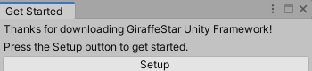
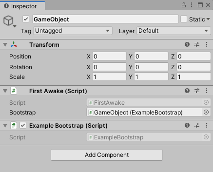

# GiraffeStar Unity Framework
is an Unity framework to make Unity games easier and faster.

It currently offers

- Event System
- Custom Coroutines
- Configuration Management
- and many more features to come!

Features will be added along as I make progress with my own game, so expect improvements in the future.


# Getting Started

Download the latest **Release** package file and import it to your Unity project.



Setup page will appear after importing. Press the Setup button to create the essential files for the framework. If the popup does not appear, try clicking the *GiraffeStar/Setup* in the menus.

In your project's initial scene, create a ``GameObject`` and add the ``FirstAwake`` component. This will initialize the framework when the scene is first loaded.

Create a new script that inherits ``BaseBootstrap`` and add it to the ``FirstAwake`` component.

```c#
using GiraffeStar;

public class ExampleBootstrap : BaseBootstrap
{
    public override void Setup()
    {
        // Add your code here to begin initialzing
    }
}
```



Add your custom ``Bootstrap`` component to ``FirstAwake``'s ``Bootstrap`` field.

And that's it! Check out the [documentation](Documentation.md) for more details about the features.

